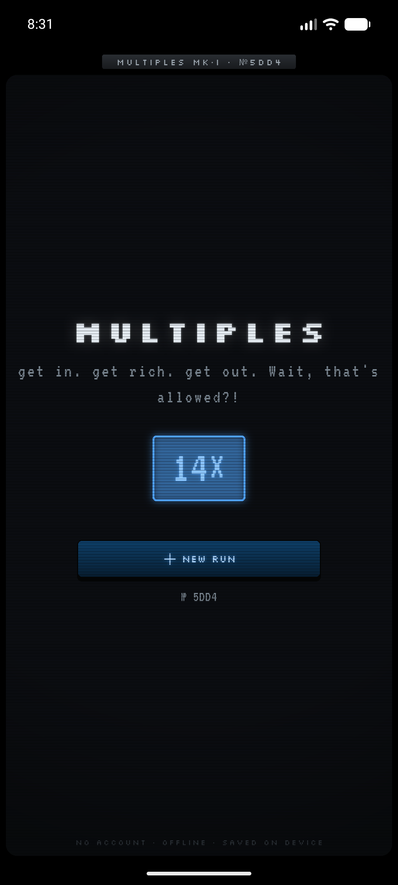
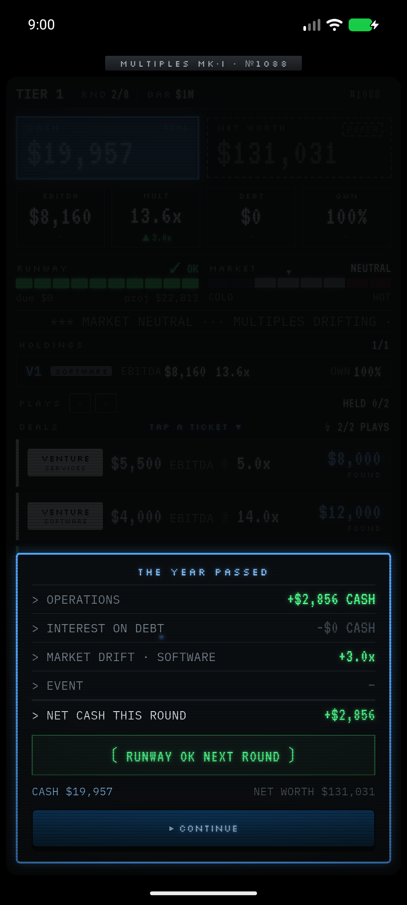
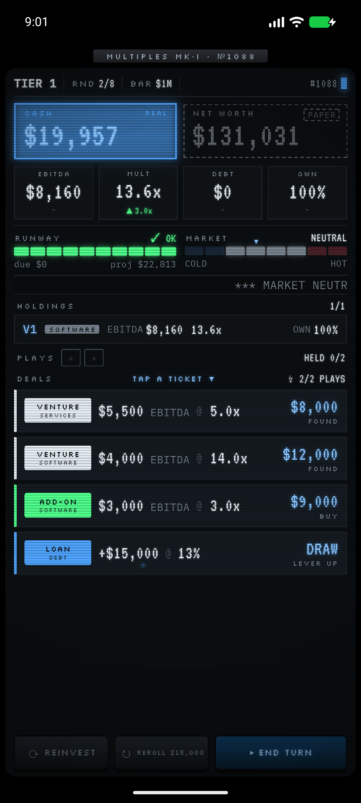
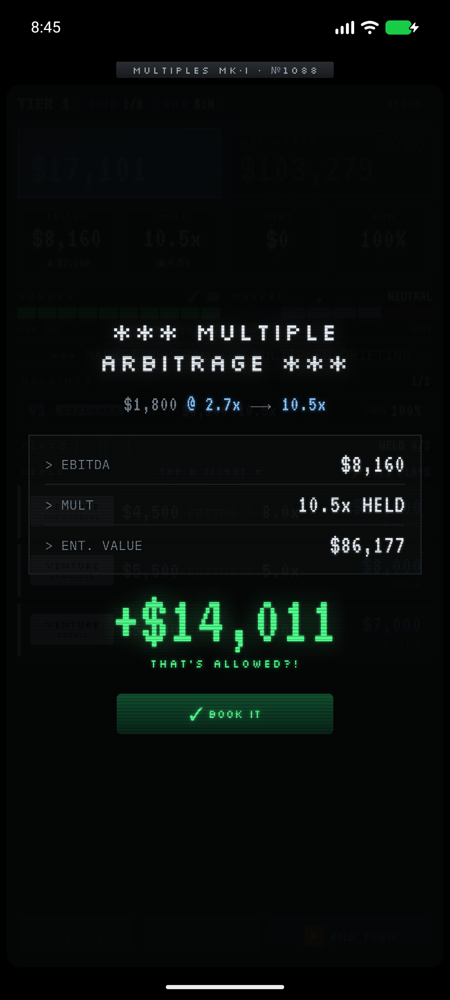
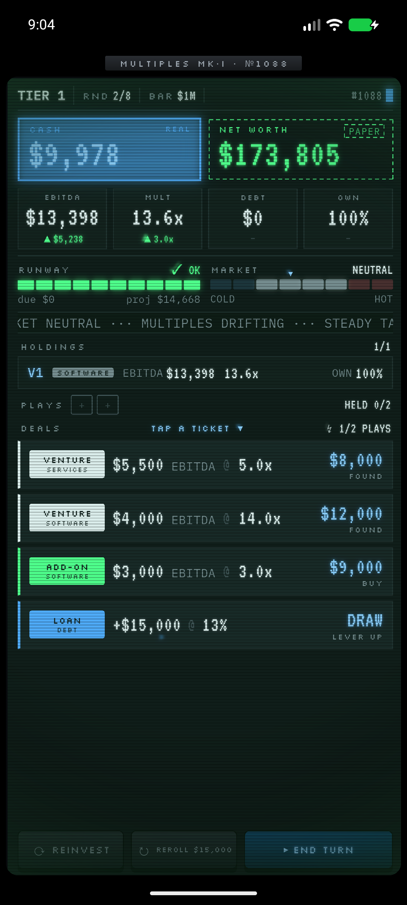
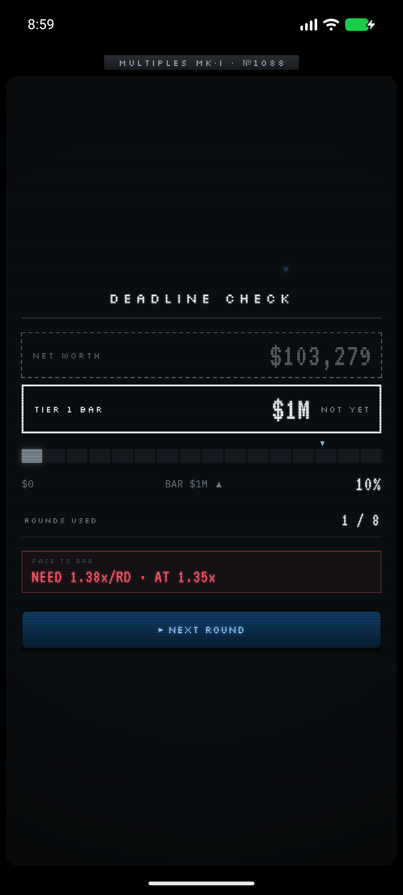

# MULTIPLES

> **get in. get rich. get out. Wait, that's allowed?!**

A finance roguelike in the spirit of Balatro: you play a scrappy entrepreneur
climbing the wealth ladder from broke to billionaire, one power-of-ten tier at
a time. Each round you draw a hand of deals (a startup to launch, a company to
bolt on, a term sheet, a loan, an exit offer) and can act on only a few, so
every choice is an underwriting call. The card shows you the EBITDA, the
multiple, and the price — but never the answer.

The hidden curriculum is high finance (valuation, multiples, leverage,
dilution, M&A, exits), taught not by lectures but by making the optimal play
identical to the correct financial instinct. You never read a tooltip essay;
you *feel* dilution by watching a number you care about move.

It is single-player, fully offline, no accounts, no server — saves live on your
device.

## The one equation the whole game is built on

```
Enterprise Value (EV) = EBITDA × Multiple
Equity Value          = EV − Net Debt
NET WORTH (score)     = Σ ( Ownership% × Equity Value )  +  Cash in pocket
```

Two tensions drive every decision:

- **Raising grows the pie but cuts your slice** (dilution).
- **Net worth is paper fantasy** — rendered in ghosted ink, unspendable —
  **until you exit and turn it into solid cash**, if you time the market right.

The signature thrill is **multiple arbitrage**: buy a cheap company, bolt it
onto your expensive platform, and watch its earnings instantly revalue
("that's allowed?!") — tempered by the conglomerate discount, so it teaches
discipline, not free money. Greed is genuinely tempting and occasionally fatal:
over-lever into a credit crunch or hold too long into a cold market and you die
with millions on paper and nothing in pocket. The death screen names the exact
instinct that killed you.

**You win at $1,000,000,000 net worth.** An endless mode continues for
score-chasers with escalating modifiers.

## Screenshots

| | | |
|---|---|---|
|  |  |  |
|  |  |  |

More in [`docs/screenshots/`](docs/screenshots/).

## Play

<!-- PUBLISH TODO: paste the real URLs below once the listings are live.
     - itch.io browser link  -> from your itch project page (e.g. https://YOURNAME.itch.io/multiples)
     - GitHub Releases link   -> the release page or the direct .apk asset URL
     See PUBLISH-GUIDE.md (in the build outputs) for the exact steps. -->

- **Play in browser:** _(itch.io link — TODO: paste your `https://YOURNAME.itch.io/multiples` URL here at publish)_
- **Download APK (Android):** _(GitHub Releases link — TODO: paste your `https://github.com/YOURNAME/multiples/releases` URL here at publish)_

The browser build ships as **WebAssembly** (see Building, below) — it needs a
reasonably modern browser with WasmGC (current Chrome / Edge / Firefox).

### How to play

1. Each round you draw a hand of deals. You have limited actions — pick the
   ones that underwrite well.
2. Grow EBITDA by operating; raise the multiple by scaling and story; mind the
   net debt and your ownership slice.
3. **Net worth is paper.** Exit a venture to convert paper value into real
   cash — but only a clean exit in a warm market pays full price.
4. Beat each tier's deadline. Clear $1B to roll the credits, or push into
   endless mode.

## Building

This is a Dart engine + Flutter app monorepo.

```
packages/engine/   # pure-Dart deterministic rules engine (no Flutter, no I/O)
app/               # Flutter shell (widgets read engine state, dispatch engine calls)
data/              # the economy model + card database (source of truth)
docs/              # design + art bible + UX wireframes + screenshots
```

Prerequisites: the Flutter SDK (Dart 3.12+).

```bash
# Engine tests (pure Dart):
cd packages/engine && dart test

# App: analyze + test
cd app && flutter analyze && flutter test

# Android APK
cd app && flutter build apk --release

# Web (WebAssembly).
# The engine uses 64-bit wrapping integer math (a SplitMix64 RNG + fixed-point
# sentinels) that dart2js cannot represent exactly, so the web target is
# WASM-only. Tree-shaking icons is disabled because there is no dart2js kernel
# to subset against in a wasm-only build:
cd app && flutter build web --wasm --release --no-tree-shake-icons
# Output: app/build/web — serve it with any static file server.
```

> **IMPORTANT — building the web bundle needs a local Flutter SDK patch.**
> Flutter 3.44.1's `flutter build web --wasm` ALWAYS *also* emits a dart2js
> JavaScript fallback, and the SDK offers **no supported flag to skip it**
> (we verified: `flutter build web --help` has no `--no-js-fallback`; `--wasm`
> is documented as "with fallback to JavaScript"). That JS fallback cannot
> compile this engine (the 64-bit math above), so the build fails unless the
> fallback is removed. We remove it with a small, **reversible** local patch to
> the Flutter SDK source
> (`<flutter>/packages/flutter_tools/lib/src/commands/build_web.dart` — it omits
> the `JsCompilerConfig` under `--wasm`). On Windows, run
> [`app/tool/build_web.bat`](app/tool/build_web.bat): it auto-applies the patch
> if missing (via `app/tool/apply_web_patch.ps1`), forces a tool-snapshot
> rebuild, then runs the WASM build. To revert the patch:
> `cd <flutter> && git checkout -- packages/flutter_tools/lib/src/commands/build_web.dart`.
>
> **The produced `app/build/web` is patch-independent.** It is plain WebAssembly
> plus assets and runs on *any* static host (itch.io, GitHub Pages, etc.) with
> no patch and no special tooling. Only *producing* the build on a given machine
> needs the patch; *serving* it never does. A clean/CI machine without the patch
> cannot reproduce the build until Flutter ships a supported no-JS-fallback
> option.

## Tech stack

- **Engine:** pure Dart, deterministic and replayable (fixed-point integer
  math, a seeded SplitMix64 stream, a typed replay journal). No Flutter, no
  `dart:io`, no clock — the same seed + cursor reproduces the exact run. This
  is what makes saves a tiny journal and lets the test suite pin economic
  golden values.
- **App:** Flutter. All game logic lives in the engine; widgets only read
  `GameState` and dispatch engine calls. Persistence is two small JSON blobs
  behind a platform seam (`dart:io` files on native, `SharedPreferences` on
  web). Audio via `audioplayers`.

## Design

Designed by Kartavy with Claude Code (a two-person indie effort). The design is
documented in [`game-design-doc.md`](game-design-doc.md), the art direction in
[`docs/07-art-style-bible.md`](docs/07-art-style-bible.md), and the screen flow
in [`docs/05-ux-flow-wireframes.md`](docs/05-ux-flow-wireframes.md).

## License & credits

The **code** is released under the MIT License — see [`LICENSE`](LICENSE).

Third-party assets and their licenses are credited in [`NOTICE`](NOTICE)
(the OFL fonts: VT323, Silkscreen, IBM Plex Mono). The audio is original.
